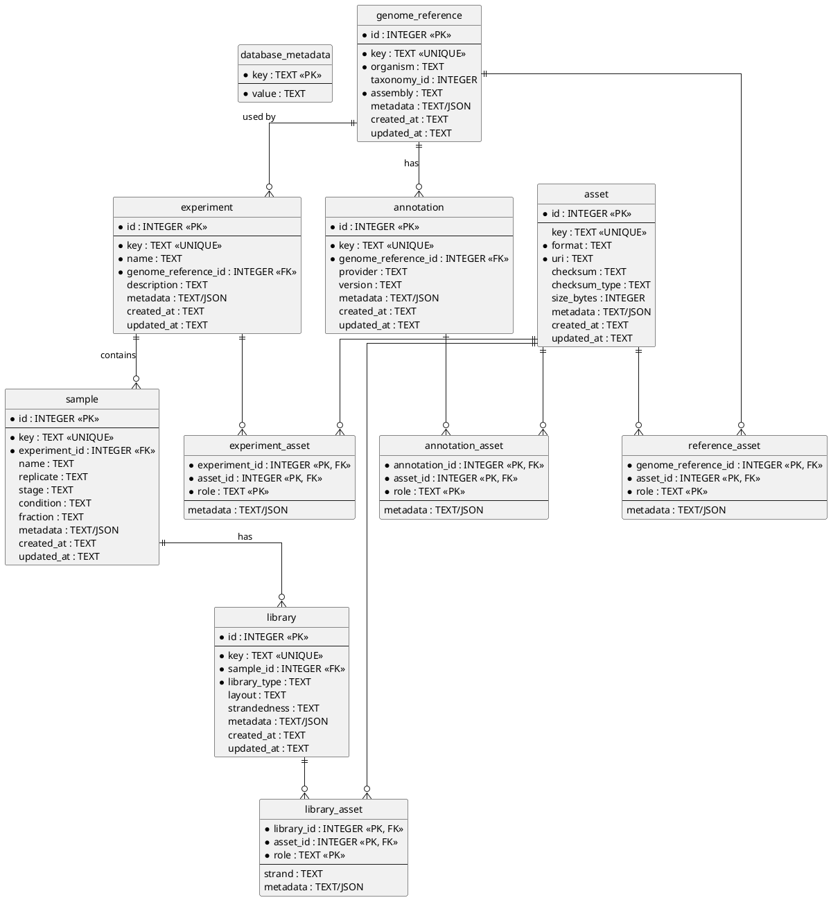

# RiboCrypt Experiment Metadata Schema v2

## Purpose

This schema replaces the current ORFik experiment CSV with a normalized SQLite database.

The goal is to keep **mutable experiment metadata** in a lightweight transactional database while leaving large genomic and analytical datasets in formats better suited to their access patterns, such as FASTA, BAM/CRAM, bigWig, Parquet, GTF/GFF, and serialized TxDb resources.

The SQLite database acts primarily as a **catalog and relationship model**:

- experiments describe a study,
- samples describe biological or experimental units,
- libraries describe assays produced from samples,
- genome references and annotations describe the coordinate/reference system,
- assets describe physical files or external resources,
- relationship tables describe how assets are used by references, annotations, libraries, or experiments.

A central design rule is:

> Put properties intrinsic to a physical resource on `asset`; put contextual meaning on the relationship table.

For example, a file's URI, format, checksum, and size belong to `asset`. Its role as a genome sequence, aligned-read file, coverage track, or experiment-wide count matrix belongs to the relationship that connects that asset to another entity.

---

## Conceptual Model

The main biological and experimental hierarchy is:

```text
genome_reference
    |
    +-- annotation
    |
    +-- experiment
            |
            +-- sample
                    |
                    +-- library
```

Physical resources are represented independently:

```text
asset
```

Assets are associated with domain entities through explicit relationship tables:

```text
genome_reference <-> reference_asset  <-> asset
annotation       <-> annotation_asset <-> asset
library          <-> library_asset    <-> asset
experiment       <-> experiment_asset <-> asset
```

This avoids nullable polymorphic foreign keys on `asset` and allows the same asset model to be reused consistently.

---

## What Is Stored Where?

### Genome references

`genome_reference` represents a genome assembly and organism.

Example:

```text
key:         grch38
organism:    Homo sapiens
taxonomy_id: 9606
assembly:    GRCh38
```

A FASTA file is represented as an `asset`:

```text
format: fasta
uri:    /references/GRCh38.fa
```

and connected to `genome_reference` through `reference_asset`:

```text
role: genome_sequence
```

Other examples of reference assets include:

- FASTA index (`.fai`)
- aligner indexes
- chromosome metadata
- other assembly-level resources

---

### Annotations

`annotation` represents a particular annotation set for a genome reference.

Example:

```text
key:      gencode-v47
provider: GENCODE
version:  47
```

It points to:

```text
genome_reference = GRCh38
```

GTF, GFF/GFF3, and serialized TxDb representations are stored as `asset` rows and linked through `annotation_asset`.

Examples:

```text
asset format: gtf
role:         annotation_source
```

```text
asset format: gff3
role:         annotation_source
```

```text
asset format: sqlite
role:         txdb
```

A TxDb is therefore treated as a physical/queryable representation of an annotation, rather than as a separate biological entity.

---

### Experiments

`experiment` represents a study or RiboCrypt/ORFik experiment.

Each experiment references exactly one genome reference. A genome reference may have zero, one, or many annotations, and an experiment is not tied to any specific annotation.

Example:

```text
key:                 hek293-drug-a
name:                HEK293 Drug A experiment
genome_reference_id: grch38
```

Experiment-wide derived outputs can be attached through `experiment_asset`.

Examples include:

- count matrices,
- DEG result tables,
- PCA/UMAP tables,
- combined predicted ORFs,
- experiment-level QC reports.

---

### Samples

`sample` represents a biological or experimental sample.

Fields corresponding to the current ORFik experiment table include:

- `replicate`
- `stage`
- `condition`
- `fraction`

Example:

```text
name:       WT replicate 1
replicate:  1
stage:      HEK293
condition:  WT
fraction:   total
```

Less standardized metadata can be stored in the JSON `metadata` column.

Example:

```json
{
  "drug": "cycloheximide",
  "dose": "100 ug/ml",
  "timepoint": "6h"
}
```

---

### Libraries

`library` represents an assay produced from a sample.

Examples:

```text
library_type: ribo_seq
layout:       single_end
```

```text
library_type: rna_seq
layout:       paired_end
```

A sample can therefore have multiple libraries, for example an RNA-seq library and a Ribo-seq library derived from the same biological sample.

---

### Library assets

Physical files associated with a library are stored as generic `asset` rows and connected through `library_asset`.

Examples:

| Role | Format | Example |
|---|---|---|
| `aligned_reads` | BAM | `sample1.bam` |
| `aligned_reads` | CRAM | `sample1.cram` |
| `coverage` | bigWig | `sample1.bw` |
| `psite_events` | Parquet | `sample1.psites.parquet` |
| `shifted_coverage` | RDS/QS | derived ORFik object |
| `qc_report` | HTML | FASTQ/QC report |

`strand` belongs to `library_asset`, because strand describes the role a particular asset plays relative to a library rather than an intrinsic property of the file itself.

---

## SQLite Schema

The schema intentionally uses SQLite-native types and conventions.

Important notes:

- `INTEGER PRIMARY KEY` is used for internal identifiers and aliases SQLite's rowid.
- Human-readable stable identifiers use a separate unique `key`.
- JSON metadata is stored as `TEXT` and checked with `json_valid(...)`.
- Foreign-key enforcement must be enabled on every SQLite connection with `PRAGMA foreign_keys = ON`.
- Large genomic data is not stored inside SQLite; SQLite stores metadata and resource locations.

```sql
PRAGMA foreign_keys = ON;

-- ---------------------------------------------------------------------------
-- Database metadata
-- ---------------------------------------------------------------------------

CREATE TABLE database_metadata (
    key     TEXT PRIMARY KEY,
    value   TEXT NOT NULL
);

INSERT INTO database_metadata (key, value)
VALUES ('schema_version', '2');


-- ---------------------------------------------------------------------------
-- Genome references
-- ---------------------------------------------------------------------------

CREATE TABLE genome_reference (
    id              INTEGER PRIMARY KEY,
    key             TEXT NOT NULL UNIQUE,

    organism        TEXT NOT NULL,
    taxonomy_id     INTEGER,
    assembly        TEXT NOT NULL,

    metadata        TEXT
                    CHECK (
                        metadata IS NULL
                        OR json_valid(metadata)
                    ),

    created_at      TEXT NOT NULL
                    DEFAULT (strftime('%Y-%m-%dT%H:%M:%fZ', 'now')),

    updated_at      TEXT NOT NULL
                    DEFAULT (strftime('%Y-%m-%dT%H:%M:%fZ', 'now'))
);


-- ---------------------------------------------------------------------------
-- Annotation sets
-- ---------------------------------------------------------------------------

CREATE TABLE annotation (
    id                  INTEGER PRIMARY KEY,
    key                 TEXT NOT NULL UNIQUE,

    genome_reference_id INTEGER NOT NULL,

    provider            TEXT,
    version             TEXT,

    metadata            TEXT
                        CHECK (
                            metadata IS NULL
                            OR json_valid(metadata)
                        ),

    created_at          TEXT NOT NULL
                        DEFAULT (strftime('%Y-%m-%dT%H:%M:%fZ', 'now')),

    updated_at          TEXT NOT NULL
                        DEFAULT (strftime('%Y-%m-%dT%H:%M:%fZ', 'now')),

    FOREIGN KEY (genome_reference_id)
        REFERENCES genome_reference(id)
        ON UPDATE CASCADE
        ON DELETE RESTRICT
);


-- ---------------------------------------------------------------------------
-- Experiments
-- ---------------------------------------------------------------------------

CREATE TABLE experiment (
    id                  INTEGER PRIMARY KEY,
    key                 TEXT NOT NULL UNIQUE,

    name                TEXT NOT NULL,
    genome_reference_id INTEGER NOT NULL,

    description         TEXT,

    metadata            TEXT
                        CHECK (
                            metadata IS NULL
                            OR json_valid(metadata)
                        ),

    created_at          TEXT NOT NULL
                        DEFAULT (strftime('%Y-%m-%dT%H:%M:%fZ', 'now')),

    updated_at          TEXT NOT NULL
                        DEFAULT (strftime('%Y-%m-%dT%H:%M:%fZ', 'now')),

    FOREIGN KEY (genome_reference_id)
        REFERENCES genome_reference(id)
        ON UPDATE CASCADE
        ON DELETE RESTRICT
);


-- ---------------------------------------------------------------------------
-- Samples
-- ---------------------------------------------------------------------------

CREATE TABLE sample (
    id              INTEGER PRIMARY KEY,
    key             TEXT NOT NULL UNIQUE,

    experiment_id   INTEGER NOT NULL,

    name            TEXT,
    replicate       TEXT,
    stage           TEXT,
    condition       TEXT,
    fraction        TEXT,

    metadata        TEXT
                    CHECK (
                        metadata IS NULL
                        OR json_valid(metadata)
                    ),

    created_at      TEXT NOT NULL
                    DEFAULT (strftime('%Y-%m-%dT%H:%M:%fZ', 'now')),

    updated_at      TEXT NOT NULL
                    DEFAULT (strftime('%Y-%m-%dT%H:%M:%fZ', 'now')),

    FOREIGN KEY (experiment_id)
        REFERENCES experiment(id)
        ON UPDATE CASCADE
        ON DELETE CASCADE
);


-- ---------------------------------------------------------------------------
-- Libraries
-- ---------------------------------------------------------------------------

CREATE TABLE library (
    id              INTEGER PRIMARY KEY,
    key             TEXT NOT NULL UNIQUE,

    sample_id       INTEGER NOT NULL,

    library_type    TEXT NOT NULL,

    layout          TEXT
                    CHECK (
                        layout IS NULL
                        OR layout IN (
                            'single_end',
                            'paired_end',
                            'unknown'
                        )
                    ),

    strandedness    TEXT
                    CHECK (
                        strandedness IS NULL
                        OR strandedness IN (
                            'unstranded',
                            'forward',
                            'reverse',
                            'unknown'
                        )
                    ),

    metadata        TEXT
                    CHECK (
                        metadata IS NULL
                        OR json_valid(metadata)
                    ),

    created_at      TEXT NOT NULL
                    DEFAULT (strftime('%Y-%m-%dT%H:%M:%fZ', 'now')),

    updated_at      TEXT NOT NULL
                    DEFAULT (strftime('%Y-%m-%dT%H:%M:%fZ', 'now')),

    FOREIGN KEY (sample_id)
        REFERENCES sample(id)
        ON UPDATE CASCADE
        ON DELETE CASCADE
);


-- ---------------------------------------------------------------------------
-- Generic physical/external assets
-- ---------------------------------------------------------------------------

CREATE TABLE asset (
    id              INTEGER PRIMARY KEY,
    key             TEXT UNIQUE,

    format          TEXT NOT NULL,
    uri             TEXT NOT NULL,

    checksum        TEXT,
    checksum_type   TEXT,

    size_bytes      INTEGER
                    CHECK (
                        size_bytes IS NULL
                        OR size_bytes >= 0
                    ),

    metadata        TEXT
                    CHECK (
                        metadata IS NULL
                        OR json_valid(metadata)
                    ),

    created_at      TEXT NOT NULL
                    DEFAULT (strftime('%Y-%m-%dT%H:%M:%fZ', 'now')),

    updated_at      TEXT NOT NULL
                    DEFAULT (strftime('%Y-%m-%dT%H:%M:%fZ', 'now'))
);


-- ---------------------------------------------------------------------------
-- Genome-reference-to-asset relationships
-- ---------------------------------------------------------------------------

CREATE TABLE reference_asset (
    genome_reference_id INTEGER NOT NULL,
    asset_id             INTEGER NOT NULL,

    role                 TEXT NOT NULL,

    metadata             TEXT
                         CHECK (
                             metadata IS NULL
                             OR json_valid(metadata)
                         ),

    PRIMARY KEY (genome_reference_id, asset_id, role),

    FOREIGN KEY (genome_reference_id)
        REFERENCES genome_reference(id)
        ON UPDATE CASCADE
        ON DELETE CASCADE,

    FOREIGN KEY (asset_id)
        REFERENCES asset(id)
        ON UPDATE CASCADE
        ON DELETE CASCADE
);


-- ---------------------------------------------------------------------------
-- Annotation-to-asset relationships
-- ---------------------------------------------------------------------------

CREATE TABLE annotation_asset (
    annotation_id   INTEGER NOT NULL,
    asset_id        INTEGER NOT NULL,

    role            TEXT NOT NULL,

    metadata        TEXT
                    CHECK (
                        metadata IS NULL
                        OR json_valid(metadata)
                    ),

    PRIMARY KEY (annotation_id, asset_id, role),

    FOREIGN KEY (annotation_id)
        REFERENCES annotation(id)
        ON UPDATE CASCADE
        ON DELETE CASCADE,

    FOREIGN KEY (asset_id)
        REFERENCES asset(id)
        ON UPDATE CASCADE
        ON DELETE CASCADE
);


-- ---------------------------------------------------------------------------
-- Library-to-asset relationships
-- ---------------------------------------------------------------------------

CREATE TABLE library_asset (
    library_id      INTEGER NOT NULL,
    asset_id        INTEGER NOT NULL,

    role            TEXT NOT NULL,

    strand          TEXT
                    CHECK (
                        strand IS NULL
                        OR strand IN (
                            'forward',
                            'reverse'
                        )
                    ),

    metadata        TEXT
                    CHECK (
                        metadata IS NULL
                        OR json_valid(metadata)
                    ),

    PRIMARY KEY (library_id, asset_id, role),

    FOREIGN KEY (library_id)
        REFERENCES library(id)
        ON UPDATE CASCADE
        ON DELETE CASCADE,

    FOREIGN KEY (asset_id)
        REFERENCES asset(id)
        ON UPDATE CASCADE
        ON DELETE CASCADE
);


-- ---------------------------------------------------------------------------
-- Experiment-to-asset relationships
-- ---------------------------------------------------------------------------

CREATE TABLE experiment_asset (
    experiment_id   INTEGER NOT NULL,
    asset_id        INTEGER NOT NULL,

    role            TEXT NOT NULL,

    metadata        TEXT
                    CHECK (
                        metadata IS NULL
                        OR json_valid(metadata)
                    ),

    PRIMARY KEY (experiment_id, asset_id, role),

    FOREIGN KEY (experiment_id)
        REFERENCES experiment(id)
        ON UPDATE CASCADE
        ON DELETE CASCADE,

    FOREIGN KEY (asset_id)
        REFERENCES asset(id)
        ON UPDATE CASCADE
        ON DELETE CASCADE
);


-- ---------------------------------------------------------------------------
-- Indexes for common joins and lookups
-- ---------------------------------------------------------------------------

CREATE INDEX idx_annotation_reference
ON annotation(genome_reference_id);

CREATE INDEX idx_experiment_reference
ON experiment(genome_reference_id);

CREATE INDEX idx_sample_experiment
ON sample(experiment_id);

CREATE INDEX idx_library_sample
ON library(sample_id);

CREATE INDEX idx_library_type
ON library(library_type);

CREATE INDEX idx_asset_format
ON asset(format);

CREATE INDEX idx_reference_asset_asset
ON reference_asset(asset_id);

CREATE INDEX idx_reference_asset_role
ON reference_asset(role);

CREATE INDEX idx_annotation_asset_asset
ON annotation_asset(asset_id);

CREATE INDEX idx_annotation_asset_role
ON annotation_asset(role);

CREATE INDEX idx_library_asset_asset
ON library_asset(asset_id);

CREATE INDEX idx_library_asset_role
ON library_asset(role);

CREATE INDEX idx_experiment_asset_asset
ON experiment_asset(asset_id);

CREATE INDEX idx_experiment_asset_role
ON experiment_asset(role);
```

---

## Example Data Mapping

A single experiment might be represented conceptually as follows:

```text
genome_reference
  GRCh38
    |
    +-- reference_asset
    |     role = genome_sequence
    |       -> asset: /references/GRCh38.fa
    |
    +-- annotation
    |     GENCODE v47
    |       |
    |       +-- annotation_asset
    |       |     role = annotation_source
    |       |       -> asset: /references/gencode.v47.gtf
    |       |
    |       +-- annotation_asset
    |             role = txdb
    |               -> asset: /references/gencode.v47.txdb.sqlite
    |
    +-- experiment
          HEK293 Drug A
            |
            +-- sample
            |     WT replicate 1
            |       |
            |       +-- library
            |             ribo_seq
            |               |
            |               +-- library_asset
            |               |     role = aligned_reads
            |               |       -> asset: sample1.bam
            |               |
            |               +-- library_asset
            |                     role = coverage
            |                       -> asset: sample1.bw
            |
            +-- experiment_asset
                  role = transcript_counts
                    -> asset: transcript-counts.parquet
```

---

## PlantUML ER Diagram



---

## Design Consequences

This schema deliberately separates **logical entities** from **physical representations**.

A library is not a BAM file. An annotation is not a GTF file. A genome reference is not a FASTA file. Instead, those files are assets associated with logical entities.

An experiment is linked directly to exactly one genome reference. That reference may have zero, one, or many annotations, allowing annotation sets to remain independent resources rather than part of the experiment's identity.

This makes it possible for one logical object to have several representations without changing the core schema. For example, one annotation can have GTF, GFF3, and TxDb assets simultaneously, while one Ribo-seq library can have BAM, bigWig, shifted coverage, P-site Parquet, and QC-report assets.

It also preserves a clear migration path from the current ORFik experiment format while avoiding its main limitation: biological metadata, assay identity, and physical file paths are no longer conflated into the same CSV row.
